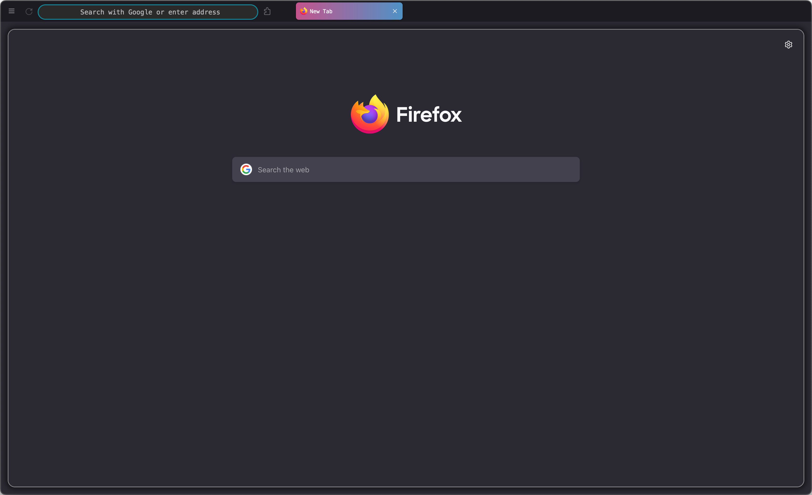
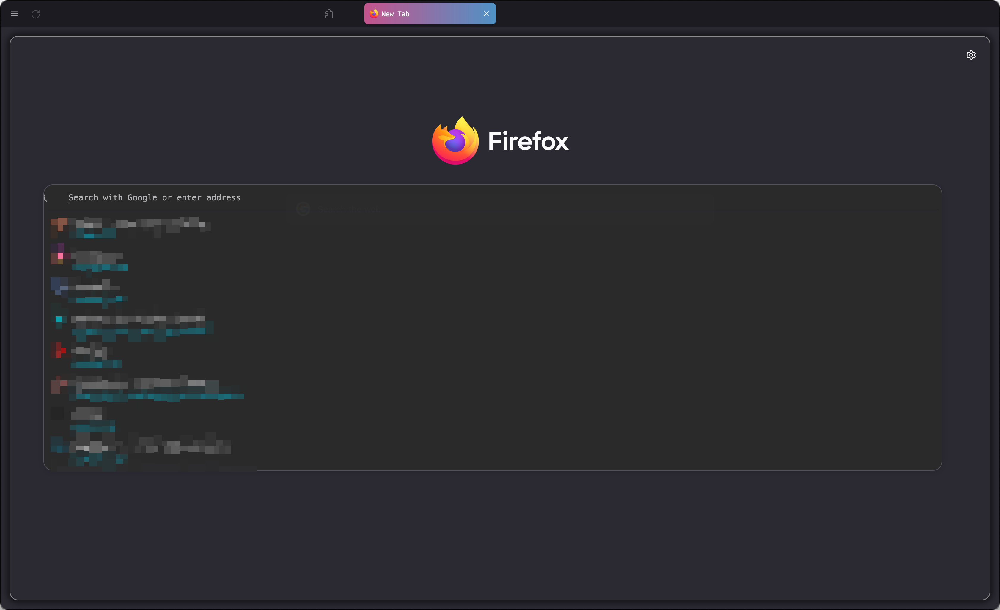
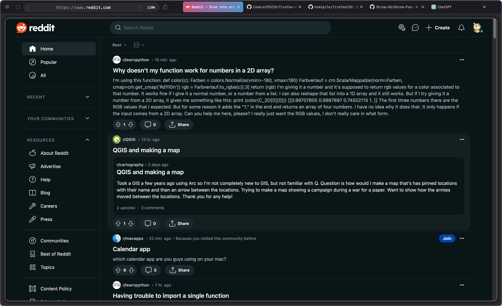
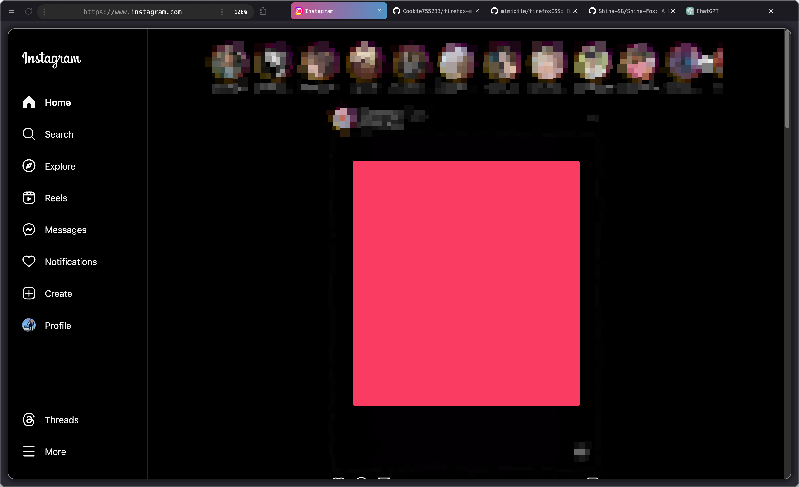

# firefox-minimal
Aim to create a minimal look of firefox *without* addons.

>Disclaimer: 
I'm no expert in CSS and as such, I may not be able to assist in resolving bugs or issues that arise from using this stylesheet. I encourage users to seek assistance from more experienced individuals or the original creater of the styles (see [Credits](#credits)) for further CSS-related problems.

# Screenshots
- **Clean look with highlighted focus tab** 
- **Popout Urlbar** 
- **Customized Reddit page (might experience some minor bugs in some resolutions)** 
- **Customized Instagram page  

# Known Bugs
Feel free to throw some prs to fix the bugs. Much aprreciated!
- Top urlbar padding is slightly offset to bottom.
- popout urlbar has a person icon(I guess) offset to left. (See [2nd screenshot](#screenshots))

# Credits
The stylesheet was inspired by [mimipile/firefoxCSS](https://github.com/mimipile/firefoxCSS) and [Shina-SG/Shina-Fox](https://github.com/Shina-SG/Shina-Fox). I have made minor adjustments based on my knowledge of CSS. Feel free to customize to your own requirements.
